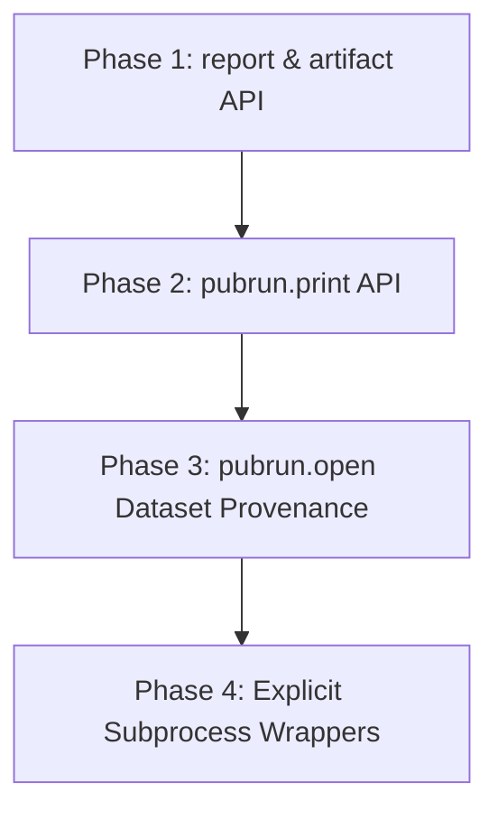

# Implementation Plan - Explicit Telemetry and Provenance API Evolution

This document outlines the design, rationale, and implementation phases to transition `pubrun` from a purely passive monitoring tool to a robust developer-centric API for explicit execution tracking, scientific reproducibility, and non-intrusive environment auditing.

---

## Background & Rationale

Currently, `pubrun` captures telemetry primarily through automatic, global monkeypatching (e.g., wrapping `sys.stdout`/`sys.stderr` and patching the `subprocess` module). While highly effective for zero-configuration monitoring, passive tracking has two significant limitations:
1. **Intrusiveness**: In strict production, high-performance computing (HPC), or multi-threaded environments, global monkeypatching can cause compatibility issues with other telemetry tools or debugging agents.
2. **Provenance Limits**: Passive tracking cannot inspect the semantic meaning of data files read or written by the python process, nor can it selectively capture user-generated reports.

By implementing an **Explicit Tracking API**, we enable researchers and developers to:
- Selectively print and log key metrics (using `pubrun.print`, `pubrun.report`, `pubrun.artifact`).
- Track data file provenance (using `pubrun.open` to automatically hash and catalog dataset files).
- Explicitly audit external subprocesses without global patches (using `pubrun.subprocess` wrappers).

This plan breaks down the design and changes into **four distinct execution phases**.

---

## Proposed Phases & Specifications

### Phase 1: Structured Reports and Artifacts

#### Goal
Provide a clean way to write final evaluation summaries and binary/text outputs directly to the run folder, registering them in the execution timeline for discovery.

#### Proposed API Methods
1. **`pubrun.report(name: str, data: Any) -> None`**
   - **Behavior**: Saves structured data (JSON for dicts/lists, plain text for strings/others) directly to the active run directory as `{name}.json` or `{name}.txt`.
   - **Integration**: Emits a `report` annotation event in `events.jsonl` containing the file name and data preview. This ensures that the report is discoverable under the Event Timeline in `pubrun report`.
   - **Safety**: Safe to call when no run is active (resolves to the `events.on_inactive_annotate` warning/error policy). Wrap file IO in `try/except` to prevent host script crashes.

2. **`pubrun.artifact(filename: str, content: Any) -> None`**
   - **Behavior**: Saves arbitrary files (text or binary bytes) to `run_dir / filename`.
   - **Integration**: Emits an `artifact` annotation event in `events.jsonl`.

#### Target Files
- [MODIFY] `src/pubrun/core.py` (Define `report` and `artifact` and register inactive handlers).
- [MODIFY] `src/pubrun/__init__.py` (Expose `report` and `artifact` in `__all__`).

---

### Phase 2: Shorter `pubrun.print` API

#### Goal
Provide a drop-in replacement for Python's built-in `print` that outputs to console (`sys.stdout`) and simultaneously captures the text in the run directory (appending to `stdout.log`), even when global console capture is disabled.

#### Proposed API Method
- **`pubrun.print(*args: Any, **kwargs: Any) -> None`**
   - **Behavior**: 
     1. Delegate to the standard `print(*args, **kwargs)` so console output behaves normally (including `sep`, `end`, and `file` routing).
     2. Check if a run is active. If active, format the string and append it to `run.run_dir / "stdout.log"`.
     3. If `ConsoleInterceptor` is active and running in `standard` or `deep` mode, prepend UTC timestamps to the log file entries.
   - **Safety**: Gracefully ignores writing if the file system is read-only, ensuring no stdout logging issues can crash the program.

#### Target Files
- [MODIFY] `src/pubrun/core.py` (Implement `print` using standard library delegation).
- [MODIFY] `src/pubrun/__init__.py` (Expose `print` in `__all__`).

---

### Phase 3: Dataset Provenance with `pubrun.open`

#### Goal
Provide a wrapper around Python's built-in `open()` that intercepts reads/writes to automatically catalog files, compute checksum hashes, and list them under a new `"data_files"` section in the run manifest.

#### Proposed API Method
- **`pubrun.open(file: Union[str, Path], mode: str = "r", **kwargs: Any) -> IO[Any]`**
   - **Behavior**:
     1. Open the file using Python's standard `open(file, mode, **kwargs)`.
     2. If a run is active, wrap the returned file stream in a proxy object (`ProvenanceFileProxy`).
     3. For **reads** (`"r"`, `"rb"`): On file open, resolve the absolute path and modification time. On file read or close, compute the SHA-256 hash and file size, and register it under `"inputs"` in the manifest.
     4. For **writes** (`"w"`, `"wb"`, `"a"`): On file close, resolve size and modification time, and register it under `"outputs"` in the manifest.
   - **Lineage Registry**: The `Run` object will maintain a `data_files` dictionary mapping resolved paths to metadata (SHA256, size, mode, timestamps).

#### Target Files
- [MODIFY] `src/pubrun/core.py` (Expose `open` wrapper).
- [MODIFY] `src/pubrun/tracker.py` (Add registry for inputs/outputs, and update `to_manifest_dict` to include the `"data_files"` structure).
- [MODIFY] `schemas/manifest.schema.json` (Update the schema definition to optionally validate the `"data_files"` object containing `"inputs"` and `"outputs"`).

---

### Phase 4: Explicit Subprocesses and Popen

#### Goal
Provide explicit subprocess execution wrappers that capture execution metadata (arguments, environment variables, exit codes, and timestamps) and save them to the subprocesses manifest list, without requiring global monkeypatching.

#### Proposed API Namespace
- **`pubrun.subprocess.run(*args: Any, **kwargs: Any) -> subprocess.CompletedProcess`**
- **`pubrun.subprocess.Popen(*args: Any, **kwargs: Any) -> subprocess.Popen`**
- **`pubrun.popen(cmd: str, mode: str = "r", bufsize: int = -1) -> IO[Any]`**
   - **Behavior**:
     1. Intercept the arguments before running, recording command array and start time.
     2. Delegate execution to the standard `subprocess.run`/`subprocess.Popen`/`os.popen`.
     3. Once the subprocess exits, record the exit code, end time, and duration.
     4. Append the record to the run's subprocess telemetry store (stored in `manifest.json` under `"subprocesses"`).

#### Target Files
- [NEW] `src/pubrun/subprocess.py` (Implement explicit wrappers).
- [MODIFY] `src/pubrun/core.py` (Expose the `subprocess` namespace and `popen` wrapper).
- [MODIFY] `src/pubrun/__init__.py` (Export `subprocess` and `popen`).

---

## Verification Plan

### Automated Tests (`tests/test_explicit_api.py`)

#### Phase 1 Tests
- **`test_report_json`**: Call `pubrun.report("metrics", {"acc": 0.95})`, assert `metrics.json` is written to the run directory, contains the correct JSON data, and `events.jsonl` contains the corresponding report annotation.
- **`test_artifact_bytes`**: Call `pubrun.artifact("data.bin", b"\x00\x01")`, assert binary file is written and event is emitted.

#### Phase 2 Tests
- **`test_pubrun_print`**: Disable global console intercept. Call `pubrun.print("hello world")`. Assert that the text is printed to stdout and that `stdout.log` inside the run directory is created and contains the printed text.

#### Phase 3 Tests
- **`test_pubrun_open_input`**: Write a dummy dataset file. Open it with `pubrun.open(path, "r")` and read it. Assert that the manifest contains the file path, correct SHA-256 hash, and size under the `"data_files.inputs"` section.
- **`test_pubrun_open_output`**: Open a file with `pubrun.open(path, "w")` and write text. Assert that after closing, the manifest contains the file path under the `"data_files.outputs"` section.

#### Phase 4 Tests
- **`test_explicit_subprocess_run`**: Disable global monkeypatching. Invoke `pubrun.subprocess.run([sys.executable, "-c", "print('hello')"])`. Assert that the command is successfully executed and registered in the `"subprocesses"` section of the manifest.
